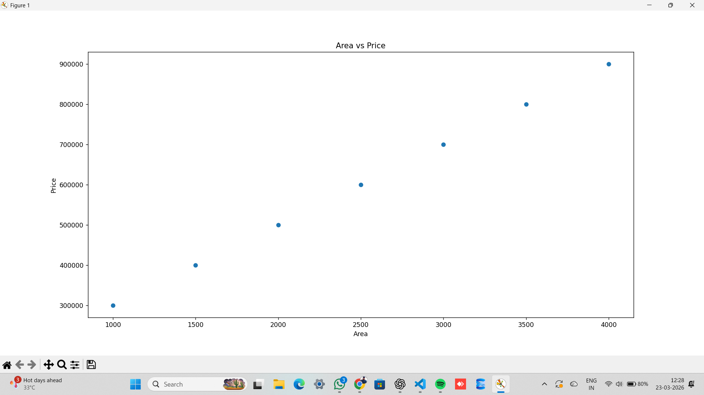

# House Price Prediction using Machine Learning

## 📊 Overview
This project predicts house prices using a real dataset based on area and number of bedrooms.

## 🔧 Tools Used
- Python
- Pandas
- Scikit-learn

## ⚙️ Model
- Linear Regression

## 📈 Features
- Data loading from CSV
- Train-test split
- Model evaluation using MAE

## 🚀 Outcome
Built a machine learning model that predicts house prices and evaluates performance.

## 📊 Visualization

